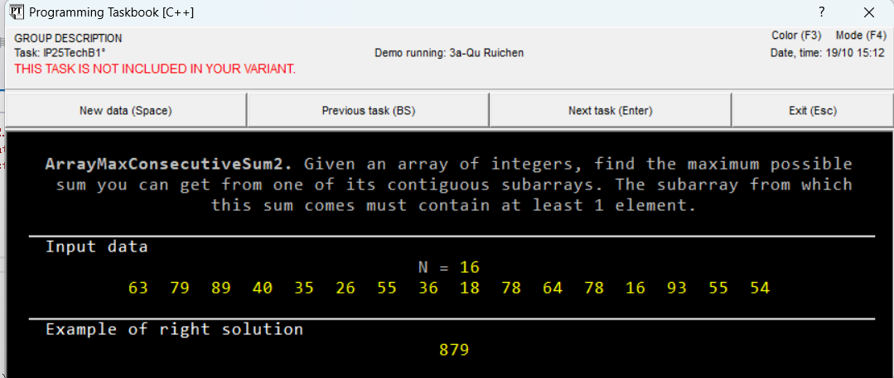
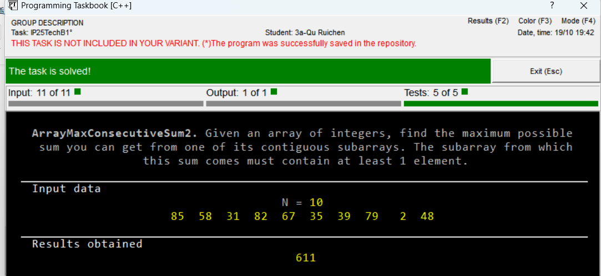
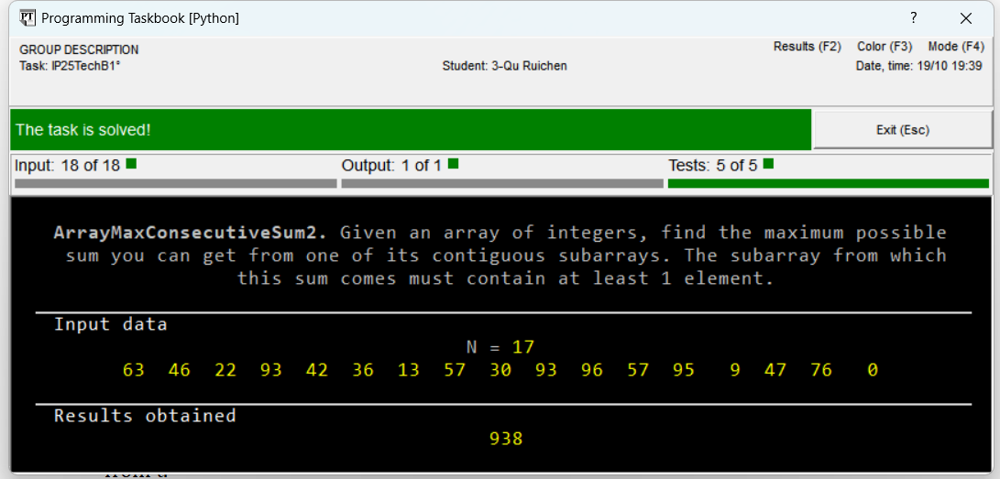

# 🧠 Algorithmic-Task-Solutions

This repository contains various algorithmic solutions and programming tasks, implemented in **Python** and **C++**. The tasks cover a wide range of topics including array manipulation, string processing, dynamic programming, and more. Each solution is carefully structured to demonstrate the implementation of specific algorithms, and is provided with clear problem descriptions and examples.

---

## 📁 Repository Structure

- `Python/`  
  Python implementations for each task are provided in this folder.

- `C++/`  
  C++ implementations for each task are provided in this folder.

---

## 🧩 Problem Set

### 🔹 IP25TechB

- **ArrayMaxConsecutiveSum2**  
  Given an array of integers, find the maximum possible sum from one of its contiguous subarrays.

- **MinSubstringWithAllChars**  
  Find and return the minimum consecutive substring that contains all characters from another string.

- **SumInRange**  
  Calculate the sum of elements in a range for a given array of integers and queries.

- **FindLongestSubarrayBySum**  
  Find the longest contiguous subarray in an array that has a sum equal to a given number.

### 🔹 CC06Wizel

- **ChatBot**  
  Simulate a chatbot that completes a conversation by matching and extending sentences based on prior conversations.

- **Roadmap**  
  Given a roadmap with tasks and queries about specific people and dates, return the list of tasks the person is working on.

---

## 🚀 Features

- Implementations of various algorithms using different programming techniques.
- Solutions to common competitive programming problems.
- Python and C++ solutions provided separately for ease of understanding and comparison.

---

## 🧰 Requirements

### Python

- Python 3.x  
  Install the required libraries using:

  ```bash
  pip install -r requirements.txt
  ···
  
### C++
No additional dependencies needed beyond a C++ compiler (e.g., g++, clang++).

## 📸 Run Example (Screenshots)

- 🔧 Problem Initial State  
  

- ✅ Solved State (C++ Version)  
  

- 🐍 Solved State (Python Version)  
  

